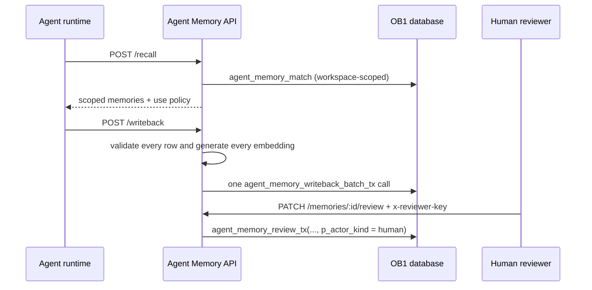

# Agent Memory API

> Runtime-neutral recall, write-back, review, inspection, and trace API for OB1 Agent Memory.



## What It Does

This Edge Function exposes the v1 OB1 Agent Memory contract. OpenClaw is the first launch runtime, but these endpoints are runtime-neutral and can be used by Codex, Claude Code, local agents, n8n, or future SQLite adapters.

## Prerequisites

1. A working Open Brain setup ([guide](../../docs/01-getting-started.md)).
1. The current [`schemas/agent-memory`](../../schemas/agent-memory/) upgrade applied; older installations do not expose the required batch, match, and reviewer-authority contracts.
1. Supabase CLI installed and authenticated for the target project.
1. `OPENROUTER_API_KEY` configured for `openai/text-embedding-3-small` embeddings.
1. A strong `MCP_ACCESS_KEY` configured for all API callers.
1. An optional, separate `REVIEWER_ACCESS_KEY`. It is required in production if humans must `confirm`, `approve`, `merge`, or `supersede` memories. Never reuse `MCP_ACCESS_KEY` for this value.

## Credential Tracker

```text
AGENT MEMORY API -- CREDENTIAL TRACKER
--------------------------------------

FROM YOUR OPEN BRAIN SETUP
  Supabase Project ref:       ____________
  MCP Access Key:             ____________
  Reviewer Access Key:        ____________
  OpenRouter API Key:         ____________

GENERATED DURING SETUP
  Agent Memory API URL:       ____________

--------------------------------------
```

## Setup

1. **Install or upgrade the schema.**

Apply [`schemas/agent-memory/schema.sql`](../../schemas/agent-memory/schema.sql).

   **Done when:** the `agent_memories` and `agent_memory_recall_traces` tables exist and PostgREST exposes `agent_memory_writeback_batch_tx`, `agent_memory_writeback_tx` with `p_embedding vector(1536)`, `agent_memory_review_tx` with final `p_embedding vector(1536)`, and `agent_memory_match`.

   > [!CAUTION]
   > Production installation is gated. Apply and verify the schema twice in a local or staging database before enabling write-back against production. Existing installations must re-apply the current schema upgrade. The sidecar tables remain isolated from existing thought content.

1. **Configure secrets.**

   ```bash
   supabase secrets set \
     OPENROUTER_API_KEY="YOUR_OPENROUTER_API_KEY" \
     MCP_ACCESS_KEY="YOUR_AGENT_ACCESS_KEY" \
     REVIEWER_ACCESS_KEY="YOUR_SEPARATE_REVIEWER_KEY"
   ```

   Omit `REVIEWER_ACCESS_KEY` only when reviewer-only actions must remain disabled. Those actions then return `403 reviewer key not configured`.

1. **Deploy the Edge Function.**

Copy this folder into your Supabase project:

```bash
supabase functions new agent-memory-api
cp integrations/agent-memory-api/index.ts supabase/functions/agent-memory-api/index.ts
cp integrations/agent-memory-api/deno.json supabase/functions/agent-memory-api/deno.json
supabase functions deploy agent-memory-api --no-verify-jwt
```

The `--no-verify-jwt` flag delegates authentication to this function's mandatory `MCP_ACCESS_KEY` check. That check accepts only `x-brain-key` or `Authorization: Bearer`; it does not accept URL query credentials. Do not deploy until the schema gate above has passed.

If the Supabase project already declares `verify_jwt = false` for this function in `supabase/config.toml`, the equivalent deployment command is `supabase functions deploy agent-memory-api`.

   **Done when:** `supabase functions list` shows `agent-memory-api` as active.

1. **Test health.**

```bash
curl \
  -H "x-brain-key: YOUR_MCP_ACCESS_KEY" \
  "https://YOUR_PROJECT_REF.supabase.co/functions/v1/agent-memory-api/health"
```

   **Done when:** the response includes `"ok": true`.

## API Surface

The API accepts the runtime-neutral core schema versions and the OpenClaw launch aliases:

| Contract | Runtime-Neutral | OpenClaw Alias |
| -------- | --------------- | -------------- |
| Recall request | `openbrain.agent_memory.recall.v1` | `openbrain.openclaw.recall.v1` |
| Recall response | `openbrain.agent_memory.recall_response.v1` | `openbrain.openclaw.recall_response.v1` |
| Write-back request | `openbrain.agent_memory.writeback.v1` | `openbrain.openclaw.writeback.v1` |
| Write-back response | `openbrain.agent_memory.writeback_response.v1` | `openbrain.openclaw.writeback_response.v1` |

| Endpoint | Method | Purpose |
| --- | --- | --- |
| `/health` | GET | Verify deployment |
| `/recall` | POST | Retrieve scoped memories before work starts |
| `/writeback` | POST | Save compact operational memory after work finishes |
| `/recall/:request_id/usage` | POST | Report which recalled memories were used or ignored |
| `/memories` | GET | List memories by workspace, project, status, runtime, type, or task prefix |
| `/memories/review` | GET | List pending agent-written memories |
| `/memories/:id` | GET | Inspect one memory with source/artifact details |
| `/memories/:id/review` | PATCH | Confirm/approve, edit, reject, restrict, stale, dispute, merge, or supersede |
| `/recall-traces/:request_id` | GET | Debug what was recalled and how it was used |

`workspace_id` is mandatory on every memory-bearing operation. Pass it in the
JSON body for `POST /recall`, `POST /writeback`, and
`PATCH /memories/:id/review`; pass it as a query parameter for
`GET /memories/:id` and `GET /recall-traces/:request_id`. A by-id lookup that
does not belong to that workspace returns the same `404` as an unknown id.

### Scope model

Recall always starts with a strict `workspace_id` boundary. Within that
workspace, visibility is evaluated as follows:

| Memory visibility | Visible when |
| --- | --- |
| `workspace` | The recall has the same `workspace_id`; project and channel do not narrow it. |
| `project` | The recall has the same non-empty `project_id`. |
| `channel` | The recall has the same non-empty `channel.id`, plus the same stored project when the memory has one. |
| `personal` | The recall has the same `runtime.name`, plus the same stored project/channel dimensions when present. |

Writeback accepts `visibility` as one of those four enum values. `project`
requires `project_id`; `channel` requires `channel.id`. When omitted, the
default is symmetric with normal recall: `channel` when a channel id exists,
otherwise `project` when a project id exists, otherwise `workspace`. Recall
without `scope.visibility` considers every visibility allowed by the table;
setting `scope.visibility` reduces recall to that exact visibility. The legacy
`scope.project_only` field remains accepted for v1 compatibility but does not
override these visibility rules.

`restrict_scope` is monotone: `workspace -> project -> channel -> personal`.
It may keep the current level or move right only when the memory already has
the required project/channel dimension. A broader target is rejected with
`400`, so review cannot expand the audience of an existing memory.

Every endpoint except the CORS preflight requires one of these supported header credentials:

```text
x-brain-key: YOUR_MCP_ACCESS_KEY
Authorization: Bearer YOUR_MCP_ACCESS_KEY
```

Credentials in `?key=...` are rejected so they cannot leak into URL, proxy, CDN, or function logs. Header credentials are compared in constant time. JSON request bodies are capped at 64 KiB.

The agent credential authenticates the caller but does not grant human review
authority. For `confirm`, `approve`, `merge`, and `supersede`, also send the
separately managed reviewer credential:

```text
x-reviewer-key: YOUR_REVIEWER_ACCESS_KEY
```

Both credentials are SHA-256 hashed and only their fixed 32-byte digests are
compared. A missing or invalid reviewer header is treated as `actor_kind=agent`;
reviewer-only actions are rejected with `403` before PostgREST is called. If
`REVIEWER_ACCESS_KEY` is absent on the server, those actions fail closed with
`403 reviewer key not configured`. Other actions remain available to agents.
In particular, an agent `edit` demotes instruction-grade memory back to pending
evidence that requires human review.

`POST /writeback` requires `idempotency_key`. The server computes a SHA-256 `content_hash` for every generated memory row and a canonical request hash for the complete row set. The canonical bytes are the UTF-8 compact JSON encoding of the ordered `[{"memory_type":"...","content":"..."}]` rows produced by the request. Reusing the same per-row key in the same workspace returns that row with `replayed=true` only when the hash matches; changed content returns `409`. A caller may send the canonical request hash in `content_hash` for end-to-end verification.

Write-back is atomic across the complete request. The API first generates and
strictly validates one 1536-number finite embedding per row. Timeout, HTTP 429,
and HTTP 5xx failures are attempted at most three times with exponential jitter;
other errors and invalid embeddings are not retried. If any row fails, the API
returns a generic server/upstream failure before any database RPC. Only after
every embedding succeeds does it make one
`agent_memory_writeback_batch_tx(p_workspace_id, p_items, p_created_by,
p_request_context)` call. Each item carries its `idempotency_key`,
`content_hash`, `memory`, `provenance`, optional sources/artifacts, and the real
embedding array. The database commits or rolls back the entire batch, including
mixed replay/new-item batches. A missing RPC returns `503` with an explicit
instruction to re-apply `schemas/agent-memory (upgrade)`.

Agent write-back accepts only `observed`, `inferred`, or `generated` provenance and always starts as evidence: `can_use_as_instruction=false`, `can_use_as_evidence=true`, `requires_user_confirmation=true`, and `review_status=pending`. Human confirmation through the review endpoint is the only API path that promotes a row to instruction-grade. Trusted bulk imports need a separately approved import path; this endpoint does not silently promote them.

Lifecycle-changing review actions (`mark_stale`, `merge`, `reject`, `dispute`, and `supersede`) require a reviewer identity and notes. `merge` and `supersede` also require a related memory in the same workspace. These actions update `lifecycle_status`; there is no physical-delete endpoint. Accepted write-backs and every review transition are committed through transactional RPCs: memory metadata, sources, artifacts, review action, relation, and audit either commit together or roll back together. The API fails closed with `503` when those RPCs are not installed.

Outbound calls are bounded: OpenRouter embedding requests time out after 15 seconds and PostgREST requests after 10 seconds. Embeddings are rejected unless they contain exactly 1536 finite numbers. Unexpected server errors return only a generic message and a short correlation id; detailed diagnostics remain in function logs.

`PATCH /memories/:id/review` re-embeds every content edit before invoking the transactional RPC, so content, content hash, and embedding change atomically; summary-only edits do not re-embed.

Query recall calls only the workspace-aware Agent Memory RPC:

```text
agent_memory_match(p_workspace_id, p_query_embedding, p_limit, p_threshold)
```

The RPC returns `(memory_id, similarity)` and enforces the workspace boundary
inside semantic matching. The API then reloads those memory ids with the same
workspace predicate before applying project, lifecycle, review, visibility,
recency, token-budget, and use-policy filters. It never joins through
`match_thoughts` or `thought_id`. A missing `agent_memory_match` RPC returns an
explicit schema-upgrade `503`.

`limits.recency_days` keeps a memory when its newest freshness timestamp
(`created_at` or `last_confirmed_at`) is within the requested window.
`limits.max_tokens` is a hard prefix budget applied after relevance ranking and
before return: each memory costs approximately
`ceil((summary characters + content characters) / 4)` tokens. Selection stops
before the first item that would exceed the budget, preserving ranking order.

## Expected outcome

An agent runtime can atomically write a multi-memory batch with its real
embeddings, recall those memories only inside the requested workspace, and
leave an auditable trace. A failed embedding or failed item persists nothing.
Agent credentials cannot promote evidence to instruction-grade memory; the
separate reviewer credential is required for human-authority transitions.
Unsafe write-backs are blocked before durable storage.

The trust model is documented in [Safe Agent Memory and Provenance](../../docs/safe-agent-memory-provenance.md).

## Smoke Harness

Run the protocol-only local smoke test before deployment. It exercises the exported Deno handler with non-secret local placeholders and never calls Supabase or OpenRouter:

```bash
deno run --allow-env test/smoke-local.mjs
```

It uses a faithful in-memory PostgREST/OpenRouter mock and verifies protocol guards,
strict cross-workspace/project/channel/runtime isolation, by-id workspace
binding, monotone `restrict_scope`, recency and token budgets, symmetric
writeback defaults, a three-item all-or-nothing batch failure, real embedding
transmission followed by same-workspace recall, one-to-one artifact persistence,
idempotent replay and conflict behavior, fixed-digest key comparison,
reviewer-only promotion, agent-edit demotion, missing-RPC fail-closed behavior,
opaque `500` responses, recall trace/item failures, and transactional review
rollback under injected review-action failure. The mock does not fabricate
legacy `thoughts`; matching runs over the embeddings inserted by the batch RPC.

Use the live smoke harness only after the production/staging installation gate and an intentional deployment or secret rotation:

```bash
OB1_AGENT_MEMORY_ENDPOINT="https://YOUR_PROJECT_REF.supabase.co/functions/v1/agent-memory-api" \
OB1_AGENT_MEMORY_KEY="YOUR_MCP_ACCESS_KEY" \
OB1_AGENT_MEMORY_WORKSPACE_ID="ob1-staging" \
OB1_AGENT_MEMORY_PROJECT_ID="agent-memory-api-smoke" \
node integrations/agent-memory-api/smoke/live-smoke.mjs
```

The harness checks health, write-back policy defaults, conservative recall gating, include-unconfirmed recall, usage reporting, review action, memory inspection, recall trace, and unsafe write-back blocking. It prints a JSON summary and never prints the access key.

For personal databases, use the cleanup harness to find or reject smoke/test memories without deleting rows:

```bash
OB1_AGENT_MEMORY_ENDPOINT="https://YOUR_PROJECT_REF.supabase.co/functions/v1/agent-memory-api" \
OB1_AGENT_MEMORY_KEY="YOUR_MCP_ACCESS_KEY" \
OB1_AGENT_MEMORY_WORKSPACE_ID="ob1-staging" \
OB1_AGENT_MEMORY_TEST_PROJECT_IDS="agent-memory-api-smoke,agent-memory-openclaw-smoke" \
node integrations/agent-memory-api/smoke/cleanup-test-memory.mjs
```

The default mode is dry-run. Add `--apply` to mark matching active test memories as `rejected`. The harness refuses project IDs that do not look like smoke/test/sandbox scopes.

## Troubleshooting

**Issue: `Invalid or missing access key`**
Solution: Send `x-brain-key` or `Authorization: Bearer`. Query-string credentials are intentionally rejected.

**Issue: recall returns no memories**
Solution: Confirm write-back has created `agent_memories`, and that those memories are confirmed or `include_unconfirmed` is true.

**Issue: write-back blocked as unsafe**
Solution: Store a compact summary and artifact links. Do not submit raw transcripts, reasoning traces, secrets, or large code blocks.

**Issue: an `agent_memory_* RPC not installed — re-apply schemas/agent-memory (upgrade)` error**
Solution: Apply the current [`schemas/agent-memory/schema.sql`](../../schemas/agent-memory/schema.sql), refresh the PostgREST schema cache if needed, and retry only after the batch writeback, match, and review RPC signatures are visible.

**Issue: `Review action requires reviewer key`**
Solution: Keep the normal agent credential and add `x-reviewer-key` with the separately managed `REVIEWER_ACCESS_KEY`. Do not put either credential in the URL.

**Issue: `reviewer key not configured`**
Solution: Set `REVIEWER_ACCESS_KEY` as a Supabase secret and redeploy before enabling human-authority review actions.

## Tool Surface Area

This integration exposes an API that plugins can wrap as tools. See the [MCP Tool Audit & Optimization Guide](../../docs/05-tool-audit.md) before adding additional runtime-specific tool surfaces.
