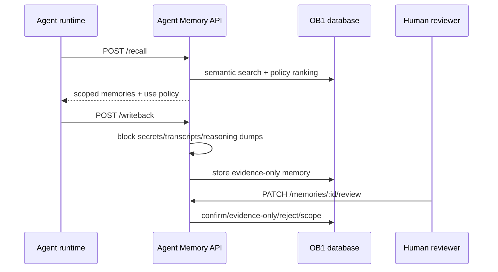

# Agent Memory API

> Runtime-neutral recall, write-back, review, inspection, and trace API for OB1 Agent Memory.



## What It Does

This Edge Function exposes the v1 OB1 Agent Memory contract. OpenClaw is the first launch runtime, but these endpoints are runtime-neutral and can be used by Codex, Claude Code, local agents, n8n, or future SQLite adapters.

## Prerequisites

- Working Open Brain setup ([guide](../../docs/01-getting-started.md))
- [`schemas/agent-memory`](../../schemas/agent-memory/) applied
- Supabase CLI installed
- `OPENROUTER_API_KEY` and `MCP_ACCESS_KEY` configured as Supabase secrets

## Credential Tracker

```text
AGENT MEMORY API -- CREDENTIAL TRACKER
--------------------------------------

FROM YOUR OPEN BRAIN SETUP
  Supabase Project ref:       ____________
  MCP Access Key:             ____________
  OpenRouter API Key:         ____________

GENERATED DURING SETUP
  Agent Memory API URL:       ____________

--------------------------------------
```

## Steps


Apply [`schemas/agent-memory/schema.sql`](../../schemas/agent-memory/schema.sql).

**Done when:** the `agent_memories` and `agent_memory_recall_traces` tables exist.

> [!CAUTION]
> Production installation is gated. Apply and verify the schema twice in a local or staging database before enabling write-back against production. The schema creates eight new sidecar tables; it does not alter `thoughts`.


Copy this folder into your Supabase project:

```bash
supabase functions new agent-memory-api
cp integrations/agent-memory-api/index.ts supabase/functions/agent-memory-api/index.ts
cp integrations/agent-memory-api/deno.json supabase/functions/agent-memory-api/deno.json
supabase functions deploy agent-memory-api --no-verify-jwt
```

The `--no-verify-jwt` flag delegates authentication to this function's mandatory `MCP_ACCESS_KEY` check. That check accepts only `x-brain-key` or `Authorization: Bearer`; it does not accept URL query credentials. Do not deploy until the schema gate above has passed.

If the Supabase project already declares `verify_jwt = false` for this function in `supabase/config.toml`, the equivalent deployment command is `supabase functions deploy agent-memory-api`.

**Done when:** `supabase functions list` shows `agent-memory-api` as active.


```bash
curl \
  -H "x-brain-key: YOUR_MCP_ACCESS_KEY" \
  "https://YOUR_PROJECT_REF.supabase.co/functions/v1/agent-memory-api/health"
```

**Done when:** the response includes `"ok": true`.

## API Surface

The API accepts the runtime-neutral core schema versions and the OpenClaw launch aliases:

| Contract | Runtime-Neutral | OpenClaw Alias |
| -------- | --------------- | -------------- |
| Recall request | `openbrain.agent_memory.recall.v1` | `openbrain.openclaw.recall.v1` |
| Recall response | `openbrain.agent_memory.recall_response.v1` | `openbrain.openclaw.recall_response.v1` |
| Write-back request | `openbrain.agent_memory.writeback.v1` | `openbrain.openclaw.writeback.v1` |
| Write-back response | `openbrain.agent_memory.writeback_response.v1` | `openbrain.openclaw.writeback_response.v1` |

| Endpoint | Method | Purpose |
| --- | --- | --- |
| `/health` | GET | Verify deployment |
| `/recall` | POST | Retrieve scoped memories before work starts |
| `/writeback` | POST | Save compact operational memory after work finishes |
| `/recall/:request_id/usage` | POST | Report which recalled memories were used or ignored |
| `/memories` | GET | List memories by workspace, project, status, runtime, type, or task prefix |
| `/memories/review` | GET | List pending agent-written memories |
| `/memories/:id` | GET | Inspect one memory with source/artifact details |
| `/memories/:id/review` | PATCH | Confirm, edit, reject, restrict, stale, dispute, or supersede |
| `/recall-traces/:request_id` | GET | Debug what was recalled and how it was used |

`workspace_id` is mandatory on every memory-bearing operation. Pass it in the
JSON body for `POST /recall`, `POST /writeback`, and
`PATCH /memories/:id/review`; pass it as a query parameter for
`GET /memories/:id` and `GET /recall-traces/:request_id`. A by-id lookup that
does not belong to that workspace returns the same `404` as an unknown id.

### Scope model

Recall always starts with a strict `workspace_id` boundary. Within that
workspace, visibility is evaluated as follows:

| Memory visibility | Visible when |
| --- | --- |
| `workspace` | The recall has the same `workspace_id`; project and channel do not narrow it. |
| `project` | The recall has the same non-empty `project_id`. |
| `channel` | The recall has the same non-empty `channel.id`, plus the same stored project when the memory has one. |
| `personal` | The recall has the same `runtime.name`, plus the same stored project/channel dimensions when present. |

Writeback accepts `visibility` as one of those four enum values. `project`
requires `project_id`; `channel` requires `channel.id`. When omitted, the
default is symmetric with normal recall: `channel` when a channel id exists,
otherwise `project` when a project id exists, otherwise `workspace`. Recall
without `scope.visibility` considers every visibility allowed by the table;
setting `scope.visibility` reduces recall to that exact visibility. The legacy
`scope.project_only` field remains accepted for v1 compatibility but does not
override these visibility rules.

`restrict_scope` is monotone: `workspace -> project -> channel -> personal`.
It may keep the current level or move right only when the memory already has
the required project/channel dimension. A broader target is rejected with
`400`, so review cannot expand the audience of an existing memory.

Every endpoint except the CORS preflight requires one of these supported header credentials:

```text
x-brain-key: YOUR_MCP_ACCESS_KEY
Authorization: Bearer YOUR_MCP_ACCESS_KEY
```

Credentials in `?key=...` are rejected so they cannot leak into URL, proxy, CDN, or function logs. Header credentials are compared in constant time. JSON request bodies are capped at 64 KiB.

`POST /writeback` requires `idempotency_key`. The server computes a SHA-256 `content_hash` for every generated memory row and a canonical request hash for the complete row set. The canonical bytes are the UTF-8 compact JSON encoding of the ordered `[{"memory_type":"...","content":"..."}]` rows produced by the request. Reusing the same key in the same workspace returns the existing rows only when both hashes match; changed content returns `409`. A caller may send that canonical request hash in `content_hash` for end-to-end verification.

Agent write-back accepts only `observed`, `inferred`, or `generated` provenance and always starts as evidence: `can_use_as_instruction=false`, `can_use_as_evidence=true`, `requires_user_confirmation=true`, and `review_status=pending`. Human confirmation through the review endpoint is the only API path that promotes a row to instruction-grade. Trusted bulk imports need a separately approved import path; this endpoint does not silently promote them.

Lifecycle-changing review actions (`mark_stale`, `merge`, `reject`, `dispute`, and `supersede`) require a reviewer identity and notes. `merge` and `supersede` also require a related memory in the same workspace. These actions update `lifecycle_status`; there is no physical-delete endpoint. Every review action and recall/writeback event is persisted in the audit trail.

The recall adapter deliberately calls the live three-argument RPC signature:

```text
match_thoughts(query_embedding, match_threshold, match_count)
```

No optional `filter` argument is assumed. Workspace, project, lifecycle, review, visibility, and use-policy filtering is applied to the matched Agent Memory rows after semantic retrieval.

`limits.recency_days` keeps a memory when its newest freshness timestamp
(`created_at` or `last_confirmed_at`) is within the requested window.
`limits.max_tokens` is a hard prefix budget applied after relevance ranking and
before return: each memory costs approximately
`ceil((summary characters + content characters) / 4)` tokens. Selection stops
before the first item that would exceed the budget, preserving ranking order.

## Expected Outcome

An agent runtime can recall relevant context, write back compact memories, and leave a trace that explains what happened. Unsafe write-backs are blocked before durable storage.

The trust model is documented in [Safe Agent Memory and Provenance](../../docs/safe-agent-memory-provenance.md).

## Smoke Harness

Run the protocol-only local smoke test before deployment. It exercises the exported Deno handler with non-secret local placeholders and never calls Supabase or OpenRouter:

```bash
deno run --allow-env test/smoke-local.mjs
```

It uses an in-memory Supabase/OpenRouter mock and verifies protocol guards,
strict cross-workspace/project/channel/runtime isolation, by-id workspace
binding, monotone `restrict_scope`, recency and token budgets, symmetric
writeback defaults, and one-to-one artifact persistence.

Use the live smoke harness only after the production/staging installation gate and an intentional deployment or secret rotation:

```bash
OB1_AGENT_MEMORY_ENDPOINT="https://YOUR_PROJECT_REF.supabase.co/functions/v1/agent-memory-api" \
OB1_AGENT_MEMORY_KEY="YOUR_MCP_ACCESS_KEY" \
OB1_AGENT_MEMORY_WORKSPACE_ID="ob1-staging" \
OB1_AGENT_MEMORY_PROJECT_ID="agent-memory-api-smoke" \
node integrations/agent-memory-api/smoke/live-smoke.mjs
```

The harness checks health, write-back policy defaults, conservative recall gating, include-unconfirmed recall, usage reporting, review action, memory inspection, recall trace, and unsafe write-back blocking. It prints a JSON summary and never prints the access key.

For personal databases, use the cleanup harness to find or reject smoke/test memories without deleting rows:

```bash
OB1_AGENT_MEMORY_ENDPOINT="https://YOUR_PROJECT_REF.supabase.co/functions/v1/agent-memory-api" \
OB1_AGENT_MEMORY_KEY="YOUR_MCP_ACCESS_KEY" \
OB1_AGENT_MEMORY_WORKSPACE_ID="ob1-staging" \
OB1_AGENT_MEMORY_TEST_PROJECT_IDS="agent-memory-api-smoke,agent-memory-openclaw-smoke" \
node integrations/agent-memory-api/smoke/cleanup-test-memory.mjs
```

The default mode is dry-run. Add `--apply` to mark matching active test memories as `rejected`. The harness refuses project IDs that do not look like smoke/test/sandbox scopes.

## Troubleshooting

**Issue: `Invalid or missing access key`**
Solution: Send `x-brain-key` or `Authorization: Bearer`. Query-string credentials are intentionally rejected.

**Issue: recall returns no memories**
Solution: Confirm write-back has created `agent_memories`, and that those memories are confirmed or `include_unconfirmed` is true.

**Issue: write-back blocked as unsafe**
Solution: Store a compact summary and artifact links. Do not submit raw transcripts, reasoning traces, secrets, or large code blocks.

## Tool Surface Area

This integration exposes an API that plugins can wrap as tools. See the [MCP Tool Audit & Optimization Guide](../../docs/05-tool-audit.md) before adding additional runtime-specific tool surfaces.
