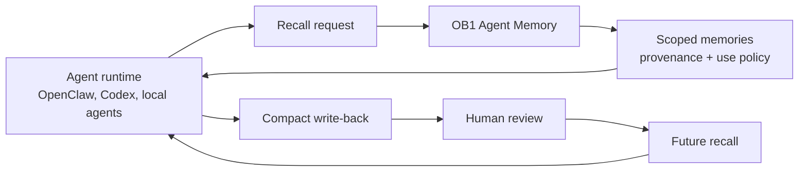

# Agent Memory

> Governed operational memory for agent runtimes, with provenance, review, recall traces, and audit trails.



## What It Does

This schema adds sidecar tables that let Open Brain store agent-created operational memory safely. The core `thoughts` table remains the content store; agent memory records add provenance, confidence, scope, use policy, review status, source references, recall traces, and audit events.

## Prerequisites

- Working Open Brain setup ([guide](../../docs/01-getting-started.md))
- Supabase project with the core `thoughts` table
- The core dedupe setup from Step 2.6 is recommended

> [!CAUTION]
> Production installation is gated. First apply and verify this schema in a disposable local or staging database. The migration is data-preserving and idempotent, but it replaces one legacy index, tightens two nullable columns, revokes legacy privileges, and creates the complete Agent Memory persistence and governance surface.

## Credential Tracker

```text
AGENT MEMORY -- CREDENTIAL TRACKER
--------------------------------------

SUPABASE (from your Open Brain setup)
  Project URL:           ____________
  Secret key:            ____________

--------------------------------------
```

## Steps


Open Supabase SQL Editor, paste the contents of [`schema.sql`](./schema.sql), and run it.

Run the same SQL a second time. A second successful execution is the installation idempotence check. The script creates eight `agent_memory_*` sidecar tables with `IF NOT EXISTS`, creates/replaces only Agent Memory helper functions, and conditionally creates its trigger and RLS policies. It does not add, alter, or remove any column on `public.thoughts`.

**Done when:** Table Editor shows `agent_memories`, `agent_memory_recall_traces`, `agent_memory_recall_items`, and `agent_memory_audit_events`.


Run this query:

```sql
SELECT column_name, column_default
FROM information_schema.columns
WHERE table_name = 'agent_memories'
  AND column_name IN (
    'can_use_as_instruction',
    'can_use_as_evidence',
    'requires_user_confirmation',
    'review_status'
  );
```

**Done when:** instruction defaults to `false`, evidence defaults to `true`, confirmation defaults to `true`, and review defaults to `pending`.


Deploy the runtime API from [`../../integrations/agent-memory-api/`](../../integrations/agent-memory-api/).

After copying the function into a Supabase project, deployment is intentionally a separate, gated operation:

```bash
supabase functions deploy agent-memory-api --no-verify-jwt
```

Do not run that command until the local/staging SQL checks and secret configuration are complete. The function performs its own mandatory header-only `MCP_ACCESS_KEY` authentication.

If `verify_jwt = false` is already configured for the function in `supabase/config.toml`, use `supabase functions deploy agent-memory-api` instead.

**Done when:** `GET /health` on the deployed API returns `{"ok":true}`.

## Expected Outcome

After applying this schema, OB1 can store agent memories as governed records instead of raw transcript dumps. Agent-written memories start as evidence-only pending review. Only `user_confirmed` or trusted `imported` memories can become instruction-grade.

`idempotency_key` and `content_hash` are mandatory for every Agent Memory row, and idempotency is unique within a workspace. Indexes cover workspace/creation time, `thought_id`, review state, lifecycle state, runtime/task, and content hashes. Enum-like values for provenance, lifecycle, visibility, memory type, review state, relations, review actions, audit events, and actor kinds are protected by `CHECK` constraints.

The persistence visibility enum is deliberately limited to `workspace`,
`project`, `channel`, and `personal`; `workspace_id` is always required. The
API enforces the exact contextual matching and runtime ownership semantics
documented in [`integrations/agent-memory-api`](../../integrations/agent-memory-api/README.md#scope-model).

The service role is granted `SELECT`, `INSERT`, and `UPDATE`, but not `DELETE`, on all eight sidecar tables. The API exposes no physical-delete route. Rejection, staleness, merging, dispute, and supersession are represented through `lifecycle_status`, reviewer records, relations, and `agent_memory_audit_events`. A database trigger writes an audit event in the same transaction as every transition to `stale`, `superseded`, `disputed`, or `rejected`, so the lifecycle change rolls back if its audit cannot be persisted.

## Transactional Governance RPCs

The schema installs these exact service-role-only signatures:

```sql
agent_memory_writeback_tx(
  text, text, text, jsonb, jsonb, jsonb, jsonb, text, jsonb
) returns jsonb

agent_memory_review_tx(
  uuid, text, text, text, text, uuid, text, text, text
) returns jsonb
```

In declaration order, writeback accepts `p_workspace_id`, `p_idempotency_key`, `p_content_hash`, `p_memory`, `p_provenance`, `p_source_refs DEFAULT '[]'`, `p_artifacts DEFAULT '[]'`, `p_created_by DEFAULT NULL`, and `p_request_context DEFAULT '{}'`. It serializes equal workspace/key pairs, returns the existing row with `replayed=true` only when the hash also matches, and otherwise creates the memory, source-reference rows, artifact rows, and one audit event in the caller's transaction. A failure in any of those database writes aborts the function call. New rows are forced to evidence-only, pending-review state; writeback provenance is limited to `observed`, `inferred`, or `generated`.

Review accepts `p_memory_id`, `p_workspace_id`, `p_action`, `p_actor_id`, `p_notes DEFAULT NULL`, `p_related_memory_id DEFAULT NULL`, `p_content DEFAULT NULL`, `p_summary DEFAULT NULL`, and `p_visibility DEFAULT NULL`. The row lock and related-memory lookup are workspace-bounded. `approve` is normalized to `confirm`; all accepted actions validate their transition before the memory update, review-action row, optional merge/supersede relation, and audit event are committed together. The function does not create or re-embed a `thoughts` row when review content changes; callers that require a synchronized thought or embedding must perform that separate workflow deliberately.

`PUBLIC` has no execution privilege on either governance RPC, and the schema grants execution only to `service_role`. Keep the service key server-side.

## Upgrade Behavior

Applying this schema to the `origin/main` Agent Memory installation performs a real in-place upgrade:

- existing null `idempotency_key` and `content_hash` values become the deterministic value `legacy:<memory-id>`, then both columns become `NOT NULL`;
- the former global partial `idx_agent_memories_idempotency_key` is dropped and replaced by the unique workspace-scoped `idx_agent_memories_workspace_idempotency_key (workspace_id, idempotency_key)`;
- legacy `visibility='organization'` rows become `workspace` before the four-level visibility check is installed;
- `DELETE` is explicitly revoked from `service_role` on all eight tables, undoing the earlier grant rather than assuming a narrower later `GRANT` revokes it;
- existing memory and child rows are retained. The migration does not remove or rewrite `thoughts` columns.

The script runs in one transaction. Backfills and index replacement can lock or scan `agent_memories`, so schedule and verify the upgrade on a representative staging copy before production.

Use [Safe Agent Memory and Provenance](../../docs/safe-agent-memory-provenance.md) as the operating guide for provenance, review status, use policy, and scope decisions.

## Local SQL Verification

With Docker running, execute:

```bash
schemas/agent-memory/test/local-db-test.sh
```

The test starts `pgvector/pgvector:pg16` as `ob-thanos-am-pg` on local port `55433`, creates a minimal live-compatible UUID `thoughts` table, applies `schema.sql` twice, exercises both transactional governance RPCs (including replay, rollback, workspace bounds, and transition validation), verifies lifecycle audit and constraints, then runs a second database through the exact checked-in `origin/main` schema fixture and the current schema. The upgrade assertions cover all eight `DELETE` revocations, both `NOT NULL` columns, index replacement, deterministic backfill, data preservation, and clean reapplication. The harness removes its container and refuses to remove a pre-existing container with the same name.

## Troubleshooting

**Issue: `agent-memory requires public.thoughts`**
Solution: Run the core Open Brain setup first.

**Issue: instruction-grade write fails**
Solution: This is usually correct. `can_use_as_instruction` is only allowed for `user_confirmed` or `imported` memory.

**Issue: API cannot read tables**
Solution: Re-run the GRANT section at the bottom of `schema.sql` and redeploy the Edge Function so PostgREST reloads the schema cache.

**Issue: `idempotency_key` or `content_hash` cannot be null**
Solution: Write through the Agent Memory API, which supplies row hashes, or include both fields when performing a deliberate direct insert.
